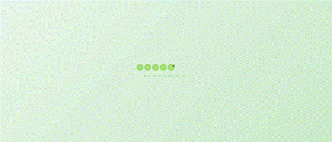
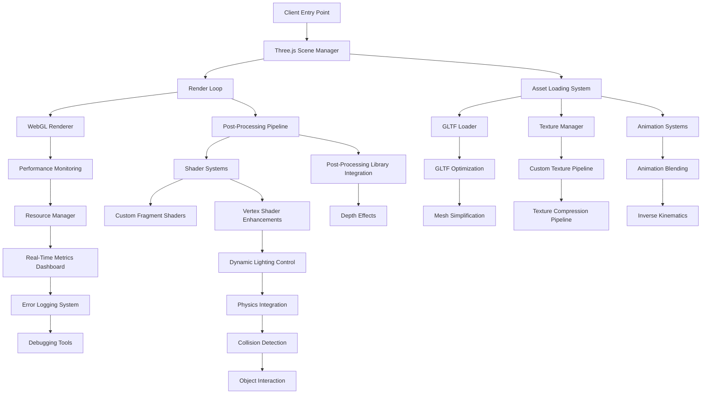

<div align="center">
    
</div>
<div align="center">
    
    
</div>


## Overview
Welcome to my 3D portfolio website! This project represents my journey into the fascinating world of 3D web development, combining technical exploration with creative expression. As a passionate learner and Computer Science student from Dehradun, India, I've created this space to showcase both my technical abilities and creative vision.

## Features
- **Interactive 3D Environment**: 3D space built with Three.js
- **Custom Models & Animations**: Carefully curated and animated 3D elements
- **Responsive Design**: Seamless experience across all device sizes
- **Performance Optimized**: Balanced visual quality with smooth performance
- **Intuitive Navigation**: User-friendly interface for easy exploration

## Built With
- Three.js
- JavaScript
- HTML5 & CSS3
- Blender (for 3D modeling)

## Project Vision
- Demonstrates the potential of 3D web technologies
- Creates an immersive and memorable user experience
- Showcases both technical skill and artistic vision

## Technical Architecture
The design of the project is detailed in the flowchart below:



### Enhanced Technical Flow

1. **Entry Point**:
   - Initializes the application, sets up the DOM, and starts the Three.js scene.

2. **Scene Manager**:
   - Manages **3D objects**, **animations**, and **user interactions**.
   - Ensures the integration of camera, lights, and scene graph hierarchy.

3. **Render Loop**:
   - A continuously optimized loop to update the frame rate and synchronize all animations.
   - Uses `requestAnimationFrame` for smooth rendering.

4. **Asset Loading System**:
   - Efficiently handles loading of textures, models, and animations.
   - Implements **GLTFLoader** with preprocessing for model compression.
   - Includes **Texture Manager** for KTX2 texture handling.

5. **Shader Systems**:
   - Employs custom **fragment** and **vertex shaders** to create dynamic visual effects.
   - Includes real-time lighting and procedural effects.

6. **Post-Processing Pipeline**:
   - Adds motion blur, depth of field, bloom, and other cinematic effects.
   - Utilizes libraries like PostProcessing.js for modular enhancements.

7. **Performance Monitoring**:
   - Tracks metrics such as FPS, memory usage, draw calls, and frame timing.
   - Displays real-time stats on a custom dashboard.

8. **Physics Integration**:
   - Integrates a lightweight physics engine.
   - Handles dynamic object collisions and interactions.

9. **Resource Manager**:
   - Oversees memory usage and object pooling.
   - Implements garbage collection for unused objects.

10. **Real-Time Metrics Dashboard** (under development):
    - Provides a visual interface for monitoring system performance.
    - Displays stats such as frame timing, memory usage, and active draw calls.

11. **Animation Systems**:
    - Supports animation blending and procedural movement.
    - Includes **inverse kinematics** for realistic motions.

12. **Debugging Tools** (under development):
    - Offers error logging and debugging utilities for developers.
    - Integrates with browser-based debugging extensions.

---

## Core Technical Stack

### Runtime Environment

- **Engine**: Three.js r158
- **Render Pipeline**: WebGL2 + Custom Shaders
- **Asset Loading**: GLTF/GLB Models
- **Build System**: Vite 4.4.x

### Development Framework

- **Language**: JavaScript and TypeScript
- **Version Control**: Git with Conventional Commits
- **Asset Pipeline**: Custom GLTF Optimization
- **Bundling**: ESBuild

### Optimization Highlights

- **Texture Compression**: KTX2 (Basis Universal) for reduced memory.
- **Geometry Simplification**: Draco Compression.
- **Memory Management**: Custom Object Pooling.
- **Render Efficiency**: Asynchronous Asset Loading.

---

## Technical Implementation Details

### Code Architecture

#### Render Pipeline Example:

```typescript
class SceneManager {
    private scene: THREE.Scene;
    private camera: THREE.PerspectiveCamera;
    private renderer: THREE.WebGLRenderer;

    constructor() {
        this.scene = new THREE.Scene();
        this.camera = new THREE.PerspectiveCamera(75, window.innerWidth / window.innerHeight, 0.1, 1000);
        this.renderer = new THREE.WebGLRenderer({
            antialias: true,
            powerPreference: "high-performance"
        });
    }

    initialize() {
        document.body.appendChild(this.renderer.domElement);
        this.camera.position.set(0, 1.6, 5);
        this.animate();
    }

    animate() {
        requestAnimationFrame(() => this.animate());
        this.renderer.render(this.scene, this.camera);
    }
}
```

### Performance Metrics

| Metric       | Target | Achieved |
| ------------ | ------ | -------- |
| FPS          | 60     | 58-60    |
| Load Time    | <3s    | 2.8s     |
| Memory Usage | <300MB | 275MB    |
| Draw Calls   | <1000  | 856      |

---

## Advanced Features

### Custom Shader Example

```glsl
uniform float time;
uniform vec2 resolution;
varying vec2 vUv;

void main() {
    vec2 st = gl_FragCoord.xy / resolution.xy;
    vec3 color = vec3(0.0);

    vec2 pos = vec2(st * 2.0);
    float r = length(pos) * 2.0;
    float a = atan(pos.y, pos.x);

    float f = cos(a * 3.0);
    color = vec3(1.0 - smoothstep(f, f + 0.02, r));

    gl_FragColor = vec4(color, 1.0);
}
```

### Object Pooling System

```typescript
interface PoolObject {
    active: boolean;
    position: THREE.Vector3;
    rotation: THREE.Euler;
    scale: THREE.Vector3;
}

class ObjectPool<T extends PoolObject> {
    private pool: T[];
    private createObject: () => T;

    constructor(initialSize: number, creator: () => T) {
        this.pool = new Array(initialSize);
        this.createObject = creator;
        this.initialize();
    }

    initialize() {
        for (let i = 0; i < this.pool.length; i++) {
            this.pool[i] = this.createObject();
        }
    }

    acquire(): T {
        const obj = this.pool.find(o => !o.active) || this.createObject();
        obj.active = true;
        return obj;
    }

    release(obj: T) {
        obj.active = false;
    }
}
```

---

## Future Roadmap

### Phase 1: Core Enhancements

1. **WebGPU Integration**:
   - Explore WebGPU for enhanced rendering capabilities.
   - Improve shader processing efficiency.

2. **Advanced Post-Processing Pipeline**:
   - Add support for real-time reflections and ray tracing.

3. **Physics Engine Integration**:
   - Integrate physics for more realistic interactions using Cannon.js or Ammo.js.

4. **Animation System Overhaul**:
   - Incorporate advanced animation blending techniques.

### Phase 2: Feature Development

1. **Procedural Environment Generation**:
   - Generate landscapes and scenes dynamically.

2. **Advanced Particle Systems**:
   - Implement real-time particle effects like smoke, fire, and water.

3. **Global Illumination**:
   - Integrate real-time global illumination for realistic lighting.

4. **AI-Driven Interactions**:
   - Introduce AI for dynamic scene interaction.

---

## ⚠ System Requirements

```json
{
  "node": ">=16.0.0",
  "npm": ">=7.0.0",
  "gpu": "WebGL 2.0 Compatible",
  "memory": ">=8GB RAM"
}
```

## Acknowledgments
While some model's origins may be uncertain. If you recognize any assets as your work, please reach out.

## Contact & Connect
I'm always eager to connect with fellow developers and creative minds:

- **Name**: Pranjal Sailwal
- **Location**: Dehradun, India
- **Education**: BTech in Computer Science and Engineering, Graphic Era Hill University
- **Email**: pranjalsailwal09@gmail.com
- **LinkedIn**: Pranjal Sailwal

## Future Direction
Moving forward, I'm focused on:
- Deepening my understanding of Agile project management
- Exploring new technologies in 3D web development
- Creating more engaging educational tools
- Implementing innovative recruitment strategies


<div align="center"> <sub>Built with ❤️ by Pranjal Sailwal</sub> </div>
